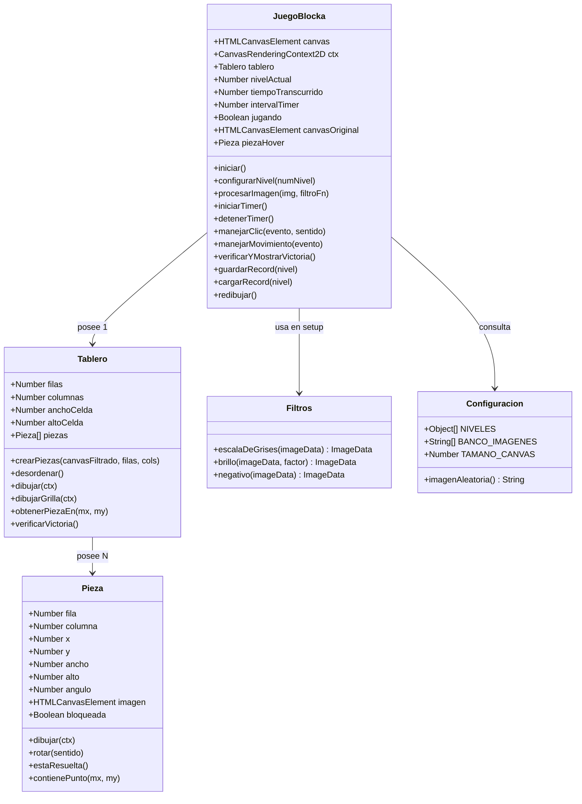
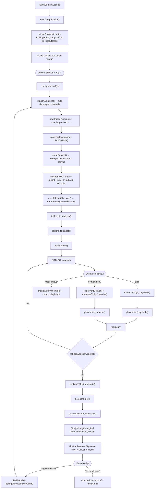
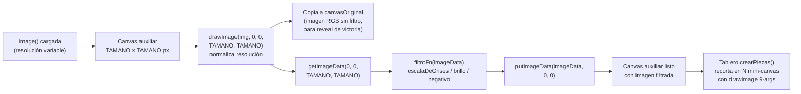

# Plan de Arquitectura e Implementación — Videojuego BLOCKA (Entregable Nº 3)

> **Materia:** Diseño de Interfaces / Interfaces de Usuario e Interacción (TUDAI / UNCPBA)  
> **Alumno:** Aitor Holzmann  
> **Fecha Límite:** 14/10/2026 a las 23:59:59 hs — Branch `gh-pages`  
> **Estado:** Fase 1 — Requisitos Base Obligatorios

---

## 1. Estructura de Archivos Propuesta

Archivos **nuevos** marcados con ✨. Los archivos existentes que se modifican se indican explícitamente.

```text
/
├── game.html                          # (MODIFICAR) — Adaptar zona de juego, agregar <script> de Blocka
├── css/
│   ├── variables.css                  # (MODIFICAR) — Agregar 3 tokens para el juego
│   ├── game.css                       # (MODIFICAR) — Agregar reglas para canvas, HUD, estados
│   └── ...                            # (sin cambios en el resto)
├── js/
│   ├── api.js                         # (existente, sin cambios)
│   ├── main.js                        # (existente, sin cambios — sidebar, carrusel 3D, comentarios)
│   ├── blocka/                        # ✨ Módulo autocontenido del juego
│   │   ├── configuracion.js           # ✨ Data-driven: banco de imágenes, niveles, constantes
│   │   ├── filtros.js                 # ✨ Funciones puras de transformación de píxeles
│   │   ├── Pieza.js                   # ✨ Clase ES6: subimagen con posición y rotación
│   │   ├── Tablero.js                 # ✨ Clase ES6: grilla, hit-test, verificación de victoria
│   │   └── blocka.js                  # ✨ Punto de entrada: orquesta DOM ↔ Canvas, timer, records
│   └── ...
├── assets/
│   └── images/
│       └── puzzles/                   # ✨ Banco de 6+ imágenes cuadradas para el puzzle
│           ├── puzzle-1.jpg
│           ├── puzzle-2.jpg
│           ├── puzzle-3.jpg
│           ├── puzzle-4.jpg
│           ├── puzzle-5.jpg
│           └── puzzle-6.jpg
└── ...
```

> [!IMPORTANT]
> Los archivos del juego residen en `js/blocka/` como módulo autocontenido. Se cargan como `<script>` clásicos (no ES Modules con `import/export`) porque el proyecto no usa bundler. Cada archivo expone su clase/funciones en el scope global `window`, consistente con cómo funcionan `api.js`, `carousel.js` y `main.js`.

### Orden de carga en `game.html` (después de `main.js`)

```html
<!-- BLOCKA — Videojuego Entregable 3 -->
<script src="js/blocka/configuracion.js"></script>
<script src="js/blocka/filtros.js"></script>
<script src="js/blocka/Pieza.js"></script>
<script src="js/blocka/Tablero.js"></script>
<script src="js/blocka/blocka.js"></script>
```

---

## 2. Diseño de Clases y Módulos

### 2.1. Diagrama Conceptual



---

### 2.2. Especificación por Módulo

#### A. `configuracion.js` — Datos del Juego (Data-Driven)

| Exporta (global) | Tipo | Responsabilidad |
|---|---|---|
| `BANCO_IMAGENES` | `String[]` | Rutas a las 6+ imágenes cuadradas en `assets/images/puzzles/` |
| `TAMANO_CANVAS` | `Number` | Dimensión lógica del canvas en px (ej. `480`, coincide con la altura actual del splash) |
| `NIVELES` | `Object[]` | Configuración por nivel: `{ numero, filas, columnas, filtro }` |
| `imagenAleatoria()` | `Function` | Devuelve una ruta aleatoria del banco con `Math.random()` |

**Estructura `NIVELES` (Fase 1, grilla fija 2×2):**

```js
var NIVELES = [
  { numero: 1, filas: 2, columnas: 2, filtro: escalaDeGrises },
  { numero: 2, filas: 2, columnas: 2, filtro: function(data) { return brillo(data, 1.3); } },
  { numero: 3, filas: 2, columnas: 2, filtro: negativo }
];
```

> [!TIP]
> **Punto OCP clave:** Para agregar niveles con grillas más grandes basta con agregar un objeto `{ filas: 2, columnas: 3, filtro: ... }`. La lógica de `Tablero` y `Pieza` no se modifica.

---

#### B. `filtros.js` — Funciones Puras de Transformación

Tres funciones que operan sobre el `Uint8ClampedArray` de un `ImageData`. Mutar in-place y retornar el mismo objeto.

| Función | Fórmula (ITU-R BT.601 / cátedra) | Firma |
|---|---|---|
| `escalaDeGrises(imageData)` | `gris = 0.299*R + 0.587*G + 0.114*B` → R=G=B=gris | `ImageData → ImageData` |
| `brillo(imageData, factor)` | `R = R * factor` (Uint8ClampedArray clampea automáticamente a 0-255) | `(ImageData, Number) → ImageData` |
| `negativo(imageData)` | `R = 255 - R`, `G = 255 - G`, `B = 255 - B` | `ImageData → ImageData` |

> [!NOTE]
> El canal Alpha (`data[i+3]`) **nunca se toca**. `Uint8ClampedArray` clampea automáticamente sin necesitar `Math.min`/`Math.max`.

---

#### C. `Pieza.js` — Clase `Pieza`

Representa una subimagen individual del puzzle. Inspirada en la jerarquía `Figure → Rect` del Tema 4.

| Propiedad | Tipo | Descripción |
|---|---|---|
| `fila` | `Number` | Fila en la grilla (0-indexed) |
| `columna` | `Number` | Columna en la grilla (0-indexed) |
| `x` | `Number` | Posición X en el canvas (px), calculada como `columna * ancho` |
| `y` | `Number` | Posición Y en el canvas (px), calculada como `fila * alto` |
| `ancho` | `Number` | Ancho de la celda (px) |
| `alto` | `Number` | Alto de la celda (px) |
| `angulo` | `Number` | Ángulo actual: `0`, `90`, `180` o `270` |
| `imagen` | `HTMLCanvasElement` | Mini-canvas con la subimagen filtrada recortada |
| `bloqueada` | `Boolean` | Fase 2: si fue fijada por "Ayudita" |

| Método | Responsabilidad |
|---|---|
| `dibujar(ctx)` | `save()` → `translate(centroX, centroY)` → `rotate(angulo * Math.PI / 180)` → `drawImage(this.imagen, -ancho/2, -alto/2)` → `restore()` |
| `rotar(sentido)` | `sentido === 'izquierda'` → `angulo = (angulo + 270) % 360`; `'derecha'` → `angulo = (angulo + 90) % 360` |
| `estaResuelta()` | Retorna `this.angulo === 0` |
| `contienePunto(mx, my)` | Hit-test AABB: `mx >= x && mx <= x + ancho && my >= y && my <= y + alto` |

> [!IMPORTANT]
> **¿Por qué mini-canvas y no `ImageData` directa?**  
> `putImageData()` **no respeta las transformaciones** del contexto (`translate`, `rotate`). Para rotar piezas necesitamos `drawImage()`, que sí las respeta. Por eso cada pieza almacena su subimagen en un `<canvas>` auxiliar (creado con `document.createElement('canvas')`), que se puede pasar como fuente a `drawImage()`.

---

#### D. `Tablero.js` — Clase `Tablero`

Gestiona la grilla completa de piezas.

| Propiedad | Tipo | Descripción |
|---|---|---|
| `filas` | `Number` | Cantidad de filas |
| `columnas` | `Number` | Cantidad de columnas |
| `anchoCelda` | `Number` | `TAMANO_CANVAS / columnas` |
| `altoCelda` | `Number` | `TAMANO_CANVAS / filas` |
| `piezas` | `Pieza[]` | Array plano de N instancias de `Pieza` |

| Método | Responsabilidad |
|---|---|
| `crearPiezas(canvasFiltrado, filas, cols)` | Para cada celda `(f, c)`: crea un mini-canvas de `anchoCelda × altoCelda`, usa `drawImage(canvasFiltrado, sx, sy, sw, sh, 0, 0, dw, dh)` para recortar la subimagen filtrada, e instancia una `new Pieza(f, c, x, y, ancho, alto, miniCanvas)`. |
| `desordenar()` | Asigna ángulos aleatorios de `[0, 90, 180, 270]` a cada pieza. Luego verifica que al menos 2 tengan ángulo ≠ 0; si no, fuerza rotación en 2 piezas al azar (scramble seguro). |
| `dibujar(ctx)` | `clearRect(0, 0, TAMANO, TAMANO)`, luego itera `piezas` llamando `pieza.dibujar(ctx)`, y finalmente `dibujarGrilla(ctx)`. |
| `dibujarGrilla(ctx)` | Dibuja líneas divisorias semitransparentes con `strokeStyle` para que las piezas sean visualmente distinguibles. |
| `obtenerPiezaEn(mx, my)` | Itera `piezas` y retorna la primera donde `contienePunto(mx, my)` devuelva `true`. |
| `verificarVictoria()` | Retorna `true` si `piezas.every(p => p.estaResuelta())`. |

**Detalle del algoritmo de scramble:**
1. A cada pieza: `angulo = [0, 90, 180, 270][Math.floor(Math.random() * 4)]`.
2. Contar cuántas tienen `angulo !== 0`.
3. Si son < 2: elegir 2 piezas al azar y forzarles un ángulo de `[90, 180, 270][aleatorio]`.
4. **Garantía:** El puzzle nunca empieza ya resuelto.

---

#### E. `blocka.js` — Clase `JuegoBlocka` (Orquestador)

Punto de entrada. Se instancia en `DOMContentLoaded`. Conecta el DOM existente de `game.html` con la lógica del canvas.

| Propiedad | Tipo | Descripción |
|---|---|---|
| `canvas` | `HTMLCanvasElement` | El `<canvas>` creado dinámicamente al presionar "Jugar" |
| `ctx` | `CanvasRenderingContext2D` | Contexto 2D |
| `tablero` | `Tablero` | Instancia del tablero activo |
| `nivelActual` | `Number` | Nivel en curso (1, 2 o 3) |
| `tiempoTranscurrido` | `Number` | Segundos transcurridos |
| `intervalTimer` | `Number|null` | ID del `setInterval` |
| `jugando` | `Boolean` | Si hay partida activa |
| `canvasOriginal` | `HTMLCanvasElement` | Canvas auxiliar con la imagen original en RGB (para reveal al ganar) |
| `piezaHover` | `Pieza|null` | Pieza actual bajo el cursor (para highlight) |

| Método | Responsabilidad |
|---|---|
| `iniciar()` | Se llama en `DOMContentLoaded`. Lee récord del `localStorage`. Conecta el `click` del `#btn-iniciar-partida` para iniciar. |
| `configurarNivel(numNivel)` | 1) `imagenAleatoria()` → ruta. 2) `new Image()` → `onload`. 3) `procesarImagen()` con el filtro del nivel. 4) `new Tablero()` → `crearPiezas()` → `desordenar()` → `dibujar()`. 5) `iniciarTimer()`. |
| `procesarImagen(img, filtroFn)` | Crea canvas auxiliar de `TAMANO×TAMANO`. `drawImage(img, 0, 0, TAMANO, TAMANO)` para normalizar resolución. `getImageData()` → `filtroFn(imageData)` → `putImageData()`. Retorna el canvas filtrado. También guarda `canvasOriginal` con la imagen sin filtro. |
| `crearCanvas()` | Crea `<canvas width="TAMANO" height="TAMANO">`, lo inserta en `#game-splash-pantalla` reemplazando el splash. |
| `iniciarTimer()` | `setInterval` cada 1000ms: incrementa `tiempoTranscurrido`, actualiza el DOM del HUD. |
| `detenerTimer()` | `clearInterval(this.intervalTimer)`. |
| `manejarClic(evento, sentido)` | Coordenadas → `obtenerPiezaEn()` → `pieza.rotar(sentido)` → `redibujar()` → `verificarYMostrarVictoria()`. |
| `manejarMovimiento(evento)` | Hit-test → actualiza `piezaHover` → cambia `canvas.style.cursor` → `redibujar()` (solo si cambió la pieza hover). |
| `verificarYMostrarVictoria()` | Si `tablero.verificarVictoria()`: detiene timer, dibuja imagen original RGB, muestra controles post-victoria, guarda récord. |
| `guardarRecord(nivel)` | Compara con `localStorage.getItem('blocka-record-nivel-' + nivel)`. Si es mejor (o no existe), guarda. |
| `cargarRecord(nivel)` | Lee de `localStorage` y retorna el valor, o `null`. |
| `redibujar()` | `tablero.dibujar(ctx)`. Si `piezaHover`, dibuja highlight encima. |

---

## 3. Flujo de Eventos y Ciclo de Vida

### 3.1. Flujo Principal



### 3.2. Procesamiento de Imagen (Detalle del Setup)



**¿Por qué un canvas auxiliar normalizado?**
- Las imágenes del banco pueden tener resoluciones distintas. El canvas auxiliar las normaliza a `TAMANO × TAMANO`.
- El filtro se aplica **una sola vez** sobre la imagen completa (no por pieza) → eficiente.
- Después, `crearPiezas()` recorta del canvas filtrado las N subimágenes con `drawImage(src, sx, sy, sw, sh, 0, 0, anchoCelda, altoCelda)`.

---

## 4. Cambios Concretos en Archivos Existentes

### 4.1. `game.html` — Adaptaciones del DOM

El HTML actual tiene un splash en `#game-splash-pantalla` (líneas 95-102) con un botón "Jugar", y una `.barra-ejecucion` (líneas 104-124) con título y 3 iconos. La estrategia es:

**a) `#game-splash-pantalla`:** El JS de Blocka **reemplazará** el contenido interno de este div por el `<canvas>` al presionar "Jugar". No se modifica el HTML estático.

**b) `.barra-ejecucion`:** Se extiende con elementos de HUD del juego (timer, récord, nivel). Los 3 iconos existentes (guardar, compartir, fullscreen) se mantienen.

```html
<!-- AGREGAR dentro de .barra-ejecucion, antes de la botonera de iconos (línea ~108) -->
<div class="blocka-hud" id="blocka-hud" style="display: none;">
  <span class="blocka-nivel" id="blocka-nivel">Nivel 1</span>
  <span class="blocka-timer" id="blocka-timer">0s</span>
  <span class="blocka-record" id="blocka-record">Récord: --</span>
</div>
```

**c) Controles post-victoria:** Se agregan como overlay oculto dentro de `#game-splash-pantalla`:

```html
<!-- AGREGAR como hermano del canvas, dentro de #game-splash-pantalla (se inyecta por JS) -->
<!-- El JS creará y mostrará estos botones dinámicamente al ganar -->
```

> [!NOTE]
> Los controles post-victoria (botones "Siguiente Nivel" y "Volver al Menú") se crean dinámicamente por JS porque dependen del estado del juego. Esto evita ensuciar el HTML estático con elementos que no tienen sentido sin la lógica del juego activa.

**d) Sección de instrucciones (líneas 128-184):** Actualizar el contenido textual para describir BLOCKA en vez de Peg Solitaire.

**e) Título y breadcrumbs:** Actualizar `<title>` (línea 6) y el breadcrumb `#game-breadcrumb-titulo` (línea 89) a "BLOCKA".

**f) Scripts:** Agregar los 5 `<script>` después de la línea 334 (`main.js`).

### 4.2. `css/variables.css` — Tokens Nuevos

Agregar al final del `:root`:

```css
/* JUEGO BLOCKA */
--color-grilla-blocka: rgba(255, 255, 255, 0.15);
--color-pieza-hover: rgba(255, 107, 0, 0.3);
--color-victoria-glow: rgba(76, 175, 80, 0.6);
```

### 4.3. `css/game.css` — Reglas Nuevas

Agregar al final del archivo (después de la media query de línea 333):

```css
/* BLOCKA — CANVAS Y HUD */
#game-splash-pantalla canvas {
  width: 100%;
  height: 100%;
  display: block;
  cursor: default;
}

.blocka-hud {
  display: flex;
  align-items: center;
  gap: 20px;
}

.blocka-nivel {
  color: var(--color-secundario);
  font-size: var(--tamano-body);
  font-weight: 700;
}

.blocka-timer {
  color: var(--color-blanco);
  font-size: var(--tamano-body);
  font-weight: 500;
}

.blocka-record {
  color: var(--color-primario-claro);
  font-size: var(--tamano-small);
  font-weight: 500;
}

/* OVERLAY POST-VICTORIA */
.blocka-overlay-victoria {
  position: absolute;
  bottom: 20px;
  left: 50%;
  padding: var(--radio-md) 24px;
  z-index: 10;

  display: flex;
  align-items: center;
  gap: 12px;

  backdrop-filter: blur(4px);
  background-color: rgba(20, 23, 20, 0.85);
  border: 1px solid var(--color-exito);
  border-radius: var(--radio-md);
  transform: translateX(-50%);
}
```

---

## 5. Estrategia de Extensibilidad (Fase 2 Ready)

### 5.1. Grillas de distinto tamaño (4, 6, 8 piezas)

**Ya soportado.** `NIVELES[i]` declara `{ filas, columnas }`. `Tablero.crearPiezas()` usa esos valores para calcular `anchoCelda = TAMANO / columnas` y `altoCelda = TAMANO / filas`. No hay un `4` hardcodeado en la lógica.

**Para activar:** `{ filas: 2, columnas: 3, filtro: ... }` → 6 piezas.

### 5.2. Filtros distintos por pieza

**Punto de extensión previsto.** Cambio localizado en `configurarNivel()`:
- El campo `filtro` en `NIVELES` puede ser una función (actual) **o un array de funciones** (una por pieza).
- `procesarImagen()` detecta el tipo y, si es array, aplica cada filtro a la subimagen correspondiente después de recortarla.
- Las funciones de `filtros.js` no cambian en absoluto.

### 5.3. "Ayudita" (+5s de penalización)

**Extensión natural sin romper la base:**
1. Agregar botón "Ayuda" en el HUD (HTML + CSS mínimo).
2. Método `usarAyuda()` en `JuegoBlocka`: selecciona pieza no resuelta → `pieza.angulo = 0` → `pieza.bloqueada = true` → `tiempoTranscurrido += 5` → `redibujar()`.
3. En `Pieza.dibujar()`: si `this.bloqueada`, dibujar borde especial.
4. En `manejarClic()`: verificar `!pieza.bloqueada` antes de rotar.

La propiedad `bloqueada` ya existe en `Pieza` (inicializada en `false`).

### 5.4. Cuenta regresiva

**Extensión directa en el timer:**
1. Campo opcional `tiempoLimite` en `NIVELES`.
2. `iniciarTimer()` detecta si existe: si sí, cuenta hacia abajo; si no, cuenta hacia arriba.
3. Método `verificarDerrota()` cuando llega a 0.

### Justificación SOLID

| Principio | Cumplimiento |
|---|---|
| **SRP** | `Pieza` = dibujo y estado de una subimagen. `Tablero` = grilla y victoria. `JuegoBlocka` = orquestación DOM↔Canvas. `filtros.js` = transformaciones puras. `configuracion.js` = datos. |
| **OCP** | Agregar nivel = agregar objeto a `NIVELES[]`. Agregar filtro = agregar función pura. No se modifica código existente. |
| **LSP** | `Pieza` respeta el contrato `Figure` de cátedra: `dibujar(ctx)` + `contienePunto(x,y)`. |
| **DIP** | `JuegoBlocka` no conoce los filtros directamente; los recibe del objeto de configuración del nivel. `Tablero` no sabe qué filtro se usó. |

---

## 6. Feedback Visual y Heurísticas de Nielsen

| Heurística | Elemento UI | Implementación Técnica |
|---|---|---|
| **Visibilidad del estado** | Timer visible, nivel actual, récord | HUD en `.barra-ejecucion` actualizado cada segundo |
| **Visibilidad del estado** | Cursor sobre pieza | `mousemove` + hit-test → `canvas.style.cursor = 'pointer'` o `'default'` |
| **Visibilidad del estado** | Highlight de pieza | `strokeRect` sutil con `var(--color-pieza-hover)` sobre la pieza bajo el cursor |
| **Retroalimentación** | Rotación de pieza | Redibujo instantáneo post-clic (sin animación → priorizar claridad sobre candy) |
| **Retroalimentación** | Victoria | Filtro removido → imagen original RGB revelada + glow verde + botones visibles |
| **Control del usuario** | "Volver al Menú" | Disponible siempre post-victoria, redirige a `index.html` |
| **Prevención de errores** | Scramble seguro | Algoritmo garantiza que el puzzle nunca empieza resuelto |
| **Consistencia** | Estilo visual | Usa tokens de `variables.css` (colores, radios, tipografía militar existente) |

**Ley de Fitts:** Con grilla 2×2, cada pieza ocupa $240 \times 240\text{px}$ (en un canvas de 480px) → target extremadamente grande y fácil de clickear.

**Ley de Hick:** La decisión del usuario es binaria por pieza: clic izquierdo o derecho. Mínima carga cognitiva.

---

## 7. Roadmap de Implementación — Fase 1

Cada tarea es atómica, testeable y produce un avance verificable con `preview.sh`.

### Etapa A: Infraestructura y Assets

| # | Tarea | Resultado Verificable |
|---|---|---|
| A1 | Crear/seleccionar 6 imágenes cuadradas y colocarlas en `assets/images/puzzles/`. Pueden recortarse de las 19+ imágenes existentes en `assets/images/` o generarse nuevas. | 6 archivos `.jpg` cuadrados existen en la ruta |
| A2 | Crear `js/blocka/configuracion.js` con `BANCO_IMAGENES`, `TAMANO_CANVAS = 480`, y array `NIVELES` (referencias a funciones de filtro como placeholder `null` hasta que exista `filtros.js`) | Archivo existe, carga sin errores |
| A3 | Crear `js/blocka/filtros.js` con `escalaDeGrises()`, `brillo()`, `negativo()` | Funciones definidas globalmente |
| A4 | Actualizar `NIVELES` en `configuracion.js` para apuntar a las funciones reales de filtros | `NIVELES[0].filtro === escalaDeGrises` funciona |
| A5 | Agregar tokens en `css/variables.css` y reglas iniciales en `css/game.css` | `preview.sh game.html desktop` muestra la zona de juego sin cambios rotos |

### Etapa B: Clases del Modelo

| # | Tarea | Resultado Verificable |
|---|---|---|
| B1 | Crear `js/blocka/Pieza.js` con constructor, `dibujar(ctx)`, `rotar(sentido)`, `estaResuelta()`, `contienePunto(mx, my)` | Clase global disponible, sin errores de sintaxis |
| B2 | Crear `js/blocka/Tablero.js` con constructor, `crearPiezas()`, `desordenar()`, `dibujar(ctx)`, `dibujarGrilla(ctx)`, `obtenerPiezaEn()`, `verificarVictoria()` | Clase global disponible |
| B3 | **Test manual desde consola:** cargar una imagen hardcodeada en un canvas temporal, crear un `Tablero`, `crearPiezas()`, `dibujar()` → verificar que las 4 subimágenes aparecen correctamente (sin rotación, sin filtro) | Las 4 subimágenes forman la imagen completa |

### Etapa C: Orquestador y Flujo

| # | Tarea | Resultado Verificable |
|---|---|---|
| C1 | Crear `js/blocka/blocka.js` con `JuegoBlocka.iniciar()`: conecta `#btn-iniciar-partida`, al presionar crea canvas, oculta splash | Presionar "Jugar" reemplaza el splash por un canvas vacío |
| C2 | Implementar `configurarNivel()` y `procesarImagen()`: carga imagen, aplica filtro, crea tablero, desordena, dibuja | Presionar "Jugar" muestra 4 piezas en escala de grises, desordenadas |
| C3 | Conectar eventos `click` y `contextmenu` (con `preventDefault()`) → `manejarClic()` → rotar pieza → `redibujar()` | Clic izquierdo/derecho rota piezas visualmente. No aparece menú contextual |
| C4 | Implementar `mousemove` → `manejarMovimiento()` → cambio de cursor + highlight | Cursor cambia a `pointer` sobre piezas. Borde sutil visible |
| C5 | Implementar `iniciarTimer()` y `detenerTimer()`. Agregar HUD en `.barra-ejecucion` y mostrarlo | Timer corre y se muestra en la barra inferior |

### Etapa D: Victoria, Records y Progresión

| # | Tarea | Resultado Verificable |
|---|---|---|
| D1 | Implementar `verificarYMostrarVictoria()`: detener timer, dibujar imagen original RGB, crear/mostrar overlay de victoria con botones | Al resolver → imagen sin filtro revelada + botones visibles |
| D2 | Implementar `guardarRecord()` y `cargarRecord()` con `localStorage` clave `blocka-record-nivel-N` | Récord persiste al recargar, se muestra en HUD |
| D3 | Conectar "Siguiente Nivel": incrementa `nivelActual`, llama `configurarNivel()` con nuevo filtro | Nivel 2 = brillo, Nivel 3 = negativo |
| D4 | Conectar "Volver al Menú": `window.location.href = 'index.html'` | Redirige correctamente |
| D5 | Manejo de fin: si `nivelActual > 3`, mostrar mensaje "¡Completaste todos los niveles!" y opción de reiniciar | Flujo correcto al completar todo |

### Etapa E: Integración y Pulido

| # | Tarea | Resultado Verificable |
|---|---|---|
| E1 | Agregar los 5 `<script>` en `game.html` (después de `main.js`, línea 334) | Página carga sin errores, juego funciona end-to-end |
| E2 | Actualizar contenido de instrucciones y galería para BLOCKA (textos, capturas) | Instrucciones describen rotación izq/der, no Peg Solitaire |
| E3 | Actualizar `<title>`, breadcrumb y `#game-barra-titulo` a "BLOCKA" | `preview.sh game.html desktop` muestra todo coherente |
| E4 | Cargar récord de `localStorage` al abrir la página (antes de jugar) y mostrarlo si existe | Si hay récord previo, se ve en el HUD al cargar |
| E5 | Test funcional completo: jugar 3 niveles, verificar filtros, timer, récord, victoria y navegación | Juego completo funcional ✅ |

---

## 8. Actualización de `AGENTS.md`

Se recomienda agregar una sección **"Reglas del Entregable 3 — Videojuego BLOCKA"** después de la sección 3 existente:

1. **Canvas 2D:** El renderizado del puzzle ocurre en un `<canvas>` dentro de `#game-splash-pantalla`. No usar elementos DOM para las piezas.
2. **ImageData:** Los filtros procesan píxeles RGBA con `getImageData`/`putImageData`. El canal Alpha no se modifica. `Uint8ClampedArray` clampea automáticamente.
3. **Prevención de menú contextual:** `canvas.addEventListener('contextmenu', e => { e.preventDefault(); ... })` es obligatorio.
4. **Renderizado event-driven:** El juego es reactivo (redibuja solo al rotar o cambiar hover). **No usar `requestAnimationFrame` en un loop infinito** — no es un juego con animación continua.
5. **Scripts del juego:** Residen en `js/blocka/` y se cargan como `<script>` clásicos en orden de dependencia.
6. **Imágenes cuadradas:** Banco en `assets/images/puzzles/`, formato cuadrado obligatorio.
7. **localStorage:** Clave `blocka-record-nivel-N` para records por nivel.

---

## 9. Apunte para Coloquio (`apuntes/videojuego-blocka.md`)

Se recomienda crear al finalizar la implementación, cubriendo:

1. **Contexto:** Vinculación con Tema 3 (Color/ImageData) y Tema 4 (Canvas/POO/Eventos).
2. **Arquitectura:** Tabla con cada archivo y su responsabilidad única (SRP).
3. **Canvas 2D:** `drawImage` 9 args, `save/translate/rotate/restore`, `getImageData/putImageData`.
4. **Filtros paso a paso:** Código con la fórmula ITU-R BT.601 y explicación de `Uint8ClampedArray`.
5. **¿Por qué mini-canvas y no ImageData para las piezas?** `putImageData` ignora transformaciones del contexto.
6. **Scramble seguro:** Demostración de que nunca empieza resuelto.
7. **Q&A de examen:**
   - ¿Qué diferencia hay entre `drawImage` y `putImageData` respecto a las transformaciones?
   - ¿Por qué el filtro se aplica en setup y no en cada frame?
   - ¿Cómo funciona el hit-testing en Canvas vs DOM?
   - ¿Qué pasa si no hago `e.preventDefault()` en `contextmenu`?
   - ¿Por qué `Uint8ClampedArray` no necesita `Math.min/max`?
8. **Pitch de 1 minuto** listo para defensa oral.
